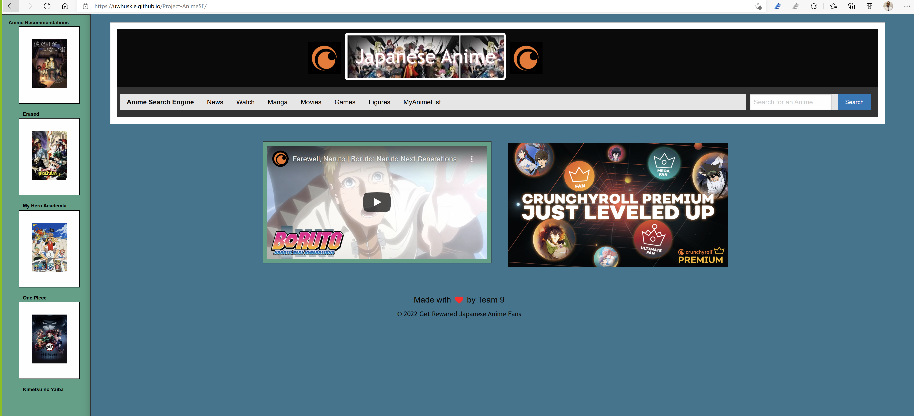
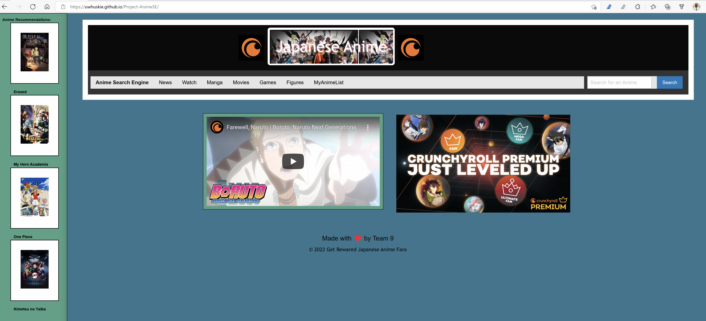

# Project-AnimeSE
<!-- This project was designed for a user to have easy access to a search engine of the genre Japanese Anime and mostly Japanese Anime related websites, links, and searches of the featured topic. A user is able to access movies, novels, comics, news, figures, and everything related to Japanese Anime. There is access to almost everything related to the Japanese Anime search engine. You can search for mainly Japanese Anime themed searches. The project used a YouTube api and a Jikan.moe api to have many results from the Anime engine. This search has popular and sugggeested Amime movies to watch. This website is very easy to use and navigate to find what you are searching for that is related to Japanese Anime. -->

<<<<<<< HEAD
<!-- This webpage displays a Japanese Anime search engine that will give you access to most Japanese Anime topics. There are buttons that will navigate you to a specific website depending on what you are search for in the nav bar. There is news, movies, manga, figures, and more to fit your search criteria. The search bar contains a search for JapaneseAnime related topics and movies depending on your search. There is two api and one is the YouTube api and the other 
Jikan.moe(Correct spelling as needed). This search engine have the features of easy access to numerous Anime related topics.  -->

=======

>>>>>>> dev
